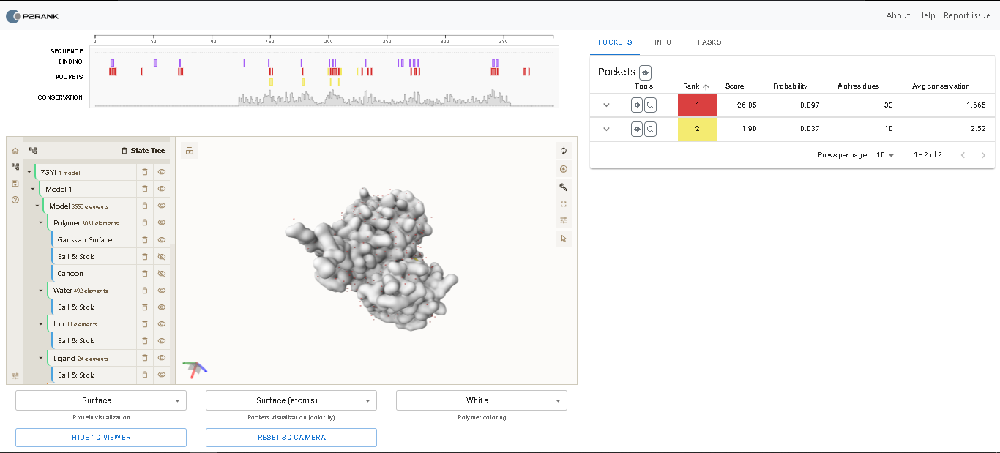
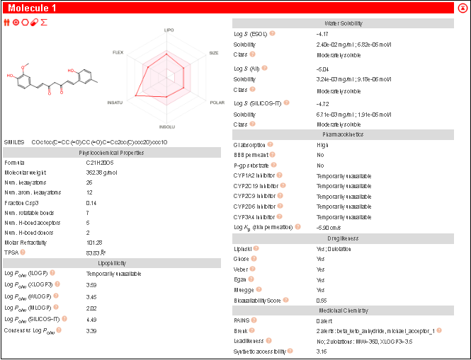
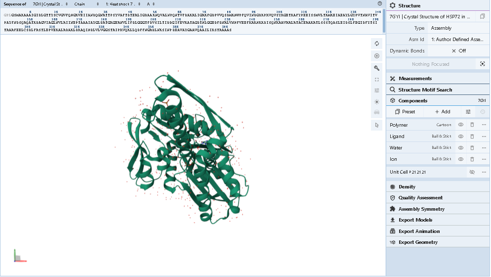
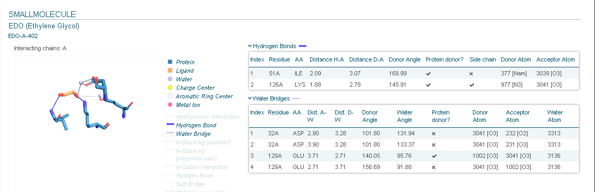

# HSP70 Molecular Docking - CADD
Molecular Dynamics Simulation profiles for Hsp70-Curcumin complex using GROMACS.

## 🗺️ Project Roadmap & Workflow

| Phase / Step | Dry-Lab Action | Wet-Lab / Biological Relevance | Key Outputs & Metrics | Status |
| :---: | :--- | :--- | :--- | :---: |
| **1. Target Selection** | Filter and download the 3D crystal structure of Human HSPA1A from **RCSB PDB**. | Ensuring high-resolution ($1.90\text{ \AA}$) human-specific protein target. | Downloaded `7GYI` and optimized via OpenBabel (`-xr -h`). | ✅ *Completed* |
| **2. Active Site Identification** | Map the co-crystallized ligand coordinates ($X, Y, Z$) using **P2RANK (PrankWeb)**. | Defining the exact binding pocket (ATP-binding domain) to prevent off-target docking. | Identified Pocket 1 centered around key dynamic residues. | ✅ *Completed* |
| **3. Virtual Screening (ADME)** | Filter a library of chemical ligands using **SwissADME** (Lipinski's Rule of 5). | Selecting compounds with high oral bioavailability and drug-likeness. | Curcumin and Thymoquinone passed all drug-likeness filters. | ✅ *Completed* |
| **4. Molecular Docking** | Run high-exhaustiveness docking utilizing **AutoDock Vina** via **Linux WSL**. | Calculating the binding affinities ($\Delta G$ in kcal/mol) to find the strongest binders. | **Curcumin** identified as top lead candidate (**-7.132 kcal/mol**). | ✅ *Completed* |
| **5. Interaction Analysis** | Visualize hydrogen bonds and hydrophobic interactions using **PLIP Server**. | Deciphering the exact molecular locks holding the drug inside the cancer-related protein. | Mapped H-bonds with core catalytic network (`Lys-1296`, `Glu-269`). | ✅ *Completed* |
| **6. Toxicity Profiling** | Predict cardiotoxicity (hERG) and liver safety using **ADMETlab 3.0**. | Filtering out toxic drug candidates before moving to in vivo studies. | Validated safety profile: **Low Risk** for hERG (0.437) & Hepatotoxicity (0.429). | ✅ *Completed* |
| **7. MD System Setup & Solvation** | Prepare topologies (`topol.top`, `curcumin_ligand.itp`) and solvate in a cubic water box using **GROMACS**. | Mimicking the physiological aqueous environment of the cellular cytoplasm. | System solvated using explicit water models and neutralized with $Na^+$/$Cl^-$ counter-ions. | ✅ *Completed* |
| **8. Energy Minimization & Equilibration** | Run Steepest Descent minimization followed by **NVT** and **NPT** ensembles. | Relaxing steric clashes and stabilizing system temperature ($310\text{ K}$) and pressure ($1\text{ bar}$). | Potential energy minimized below threshold; temperature and density stabilized. | ✅ *Completed* |
| **9. Production MD Run** | Execute a high-performance production MD simulation ($12,500,000$ steps) via Linux/WSL. | Observing the real-time dynamic stability and physical behavior of the complex. | Running a **25 ns** trajectory simulation; checkpointing enabled. | ⏳ *In Progress* |
| **10. Trajectory Analysis** | Analyze structural fluctuations post-simulation via RMSD, RMSF, Rg, and H-bonds. | Quantifying the true binding stability and binding kinetics over time. | Outputting `.xtc` / `.edr` data for plotting thermodynamic graphs. | 🎯 *Upcoming* |

---

### 📊 Visual Evidence & Analysis Figures

#### Phase 2: Active Site Identification (P2RANK)

#### Phase 3: Phytochemical Drug-Likeness Radar (SwissADME)

#### Phase 4: Target Protein Extraction (PDB: 7GYI)

#### Phase 5: Molecular Interaction Profiling (PLIP)

---

## 🧬 Project Workflow & Methodology

The project follows a comprehensive computer-aided drug design (CADD) and molecular dynamics (MD) simulation pipeline to evaluate the stability of the Hsp70-Curcumin complex:

### 1. Structure Preparation & Target Selection
* **Target Protein:** Human Heat Shock Protein 70 (HSP70 / HSPA1A) retrieved from the PDB database.
* **Ligand Preparation:** Curcumin structure retrieved, optimized, and parameterized using appropriate force fields to generate proper topology profiles.

### 2. Molecular Docking (CADD)
* Rigid and flexible docking simulations executed to identify the optimal binding pose, lowest binding energy ($kcal/mol$), and key amino acid interactions within the HSP70 nucleotide-binding domain (NBD) or substrate-binding domain (SBD).

### 3. Molecular Dynamics (MD) Simulation Setup (GROMACS)
* **System Solvation:** The protein-ligand complex is centered in a cubic box and solvated with explicit water models (e.g., SPC/E or TIP3P).
* **Charge Neutralization:** Counter-ions ($Na^+$ / $Cl^-$) added to neutralize the net charge of the system.
* **Energy Minimization:** Conducted using the Steepest Descent algorithm to remove steric clashes and optimize structural geometry.
* **Equilibration:** 
  * **NVT Ensemble:** Constant Number of particles, Volume, and Temperature to stabilize system temperature.
  * **NPT Ensemble:** Constant Number of particles, Pressure, and Temperature to stabilize system density.

### 4. Production MD Run
* A production run of **25 ns** ($12,500,000$ steps) is executed on Linux/WSL environment to capture the dynamic behavior and conformational changes of the complex.

### 5. Post-Simulation Trajectory Analysis (Upcoming)
* Evaluation of structural stability and flexibility via:
  * Root Mean Square Deviation (RMSD)
  * Root Mean Square Fluctuation (RMSF)
  * Radius of Gyration (Rg)
  * Hydrogen Bond (H-bonds) profiling over the simulation trajectory.
