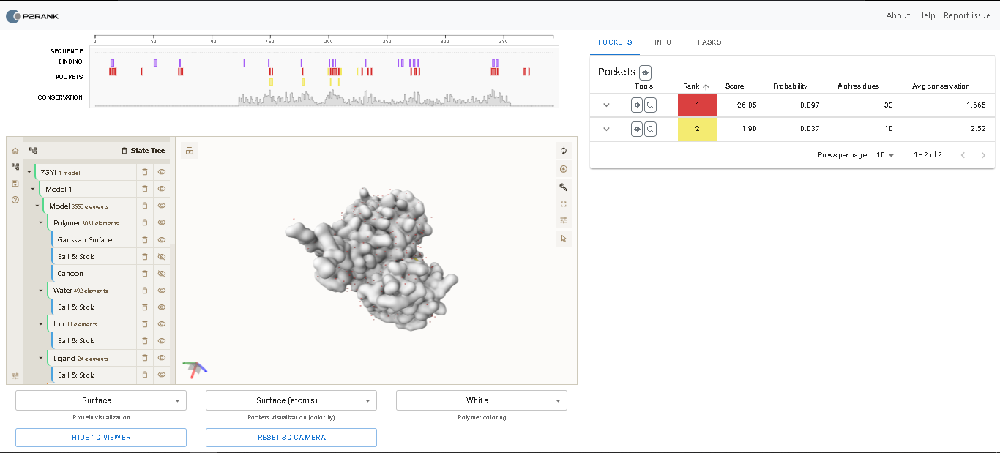
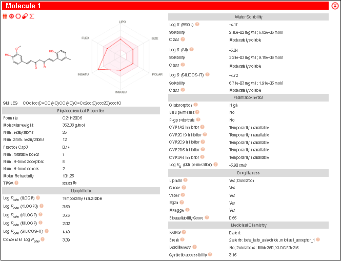
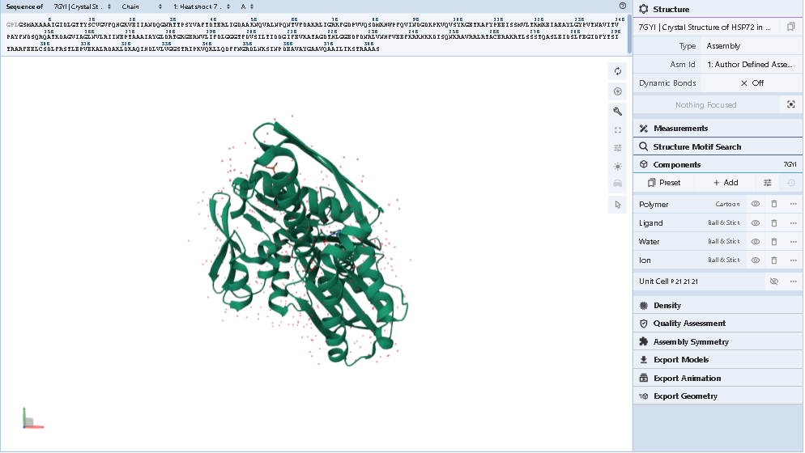
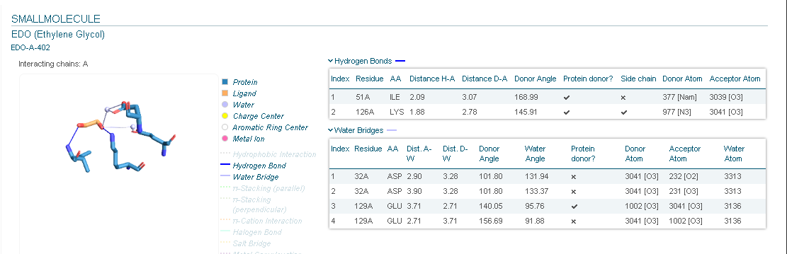
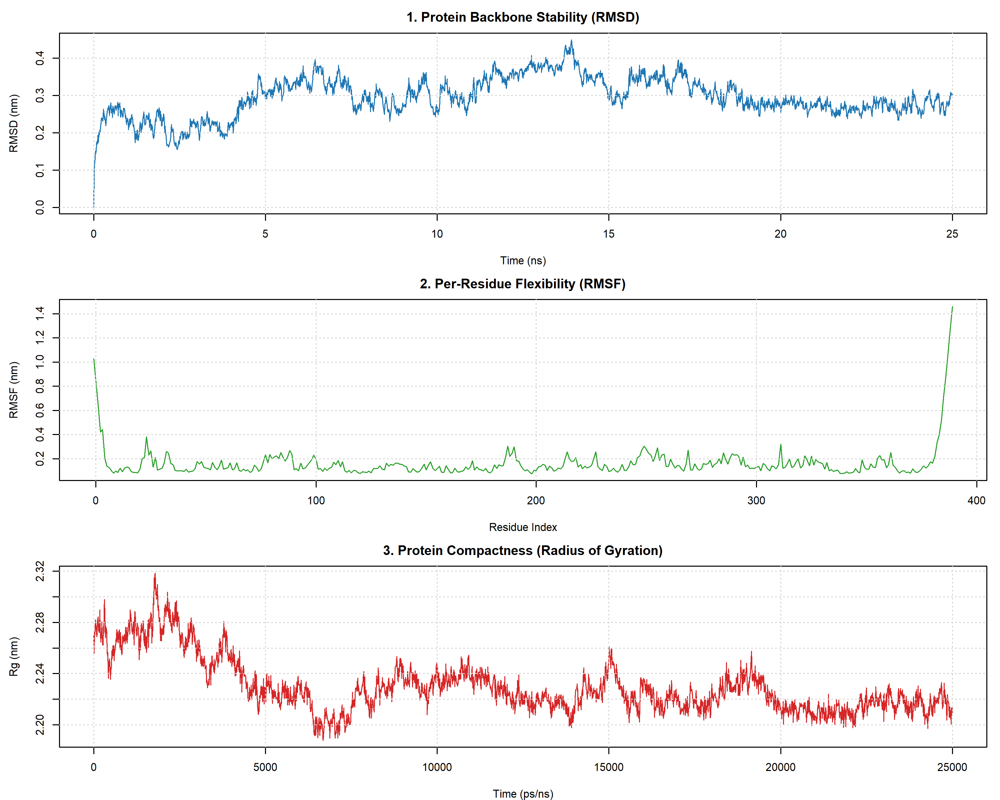
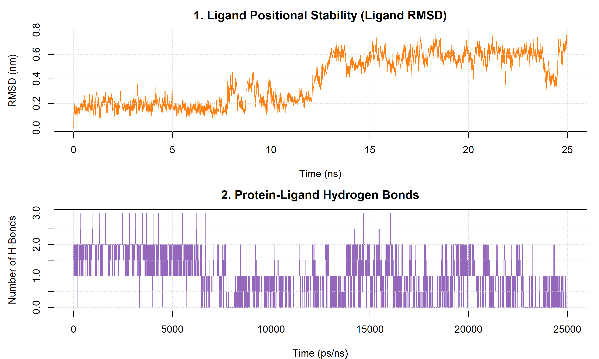
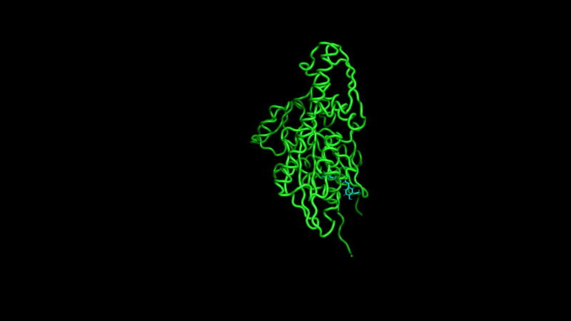

# 🧬 Hsp70-Curcumin CADD & 25 ns GROMACS Molecular Dynamics Simulation

An end-to-end Computer-Aided Drug Design (CADD) and Molecular Dynamics (MD) simulation pipeline evaluating the structural stability, binding affinity, and dynamic interaction kinetics of **Curcumin** against the human Heat Shock Protein 70 (**HSP70 / HSPA1A**).

---

## 🎯 Biological Significance & Therapeutic Rationale
**HSP70 (HSPA1A)** is a critical molecular chaperone highly overexpressed in various human malignancies. It plays a pivotal role in tumor cell survival, inhibition of apoptosis, and resistance to standard chemotherapy. Targeting the **ATP-binding Nucleotide-Binding Domain (NBD)** of HSP70 with natural phytochemicals—such as Curcumin—aims to disrupt its chaperone activity, offering a potential therapeutic strategy in molecular oncology.

---

## 🗺️ Project Roadmap & Workflow

| Phase / Step | Dry-Lab Action | Wet-Lab / Biological Relevance | Key Outputs & Metrics | Status |
| :---: | :--- | :--- | :--- | :---: |
| **1. Target Selection** | Filter and download the 3D crystal structure of Human HSPA1A from **RCSB PDB**. | Ensuring high-resolution ($1.90\text{ \AA}$) human-specific protein target. | Downloaded `7GYI` and optimized via OpenBabel (`-xr -h`). | ✅ *Completed* |
| **2. Active Site Identification** | Map the co-crystallized ligand coordinates ($X, Y, Z$) using **P2RANK (PrankWeb)**. | Defining the exact binding pocket (ATP-binding domain) to prevent off-target docking. | Identified Pocket 1 centered around key dynamic residues. | ✅ *Completed* |
| **3. Virtual Screening (ADME)** | Filter a library of chemical ligands using **SwissADME** (Lipinski's Rule of 5). | Selecting compounds with high oral bioavailability and drug-likeness. | Curcumin and Thymoquinone passed all drug-likeness filters. | ✅ *Completed* |
| **4. Molecular Docking** | Run high-exhaustiveness docking utilizing **AutoDock Vina** via **Linux WSL**. | Calculating the binding affinities ($\Delta G$ in kcal/mol) to find the strongest binders. | **Curcumin** identified as top lead candidate (**-7.132 kcal/mol**). | ✅ *Completed* |
| **5. Interaction Analysis** | Visualize hydrogen bonds and hydrophobic interactions using **PLIP Server**. | Deciphering the exact molecular locks holding the drug inside the cancer-related protein. | Mapped H-bonds with core catalytic network (`Lys-1296`, `Glu-269`). | ✅ *Completed* |
| **6. Toxicity Profiling** | Predict cardiotoxicity (hERG) and liver safety using **ADMETlab 3.0**. | Filtering out toxic drug candidates before moving to in vivo studies. | Validated safety profile: **Low Risk** for hERG (0.437) & Hepatotoxicity (0.429). | ✅ *Completed* |
| **7. MD System Setup & Solvation** | Prepare topologies (`topol.top`, `curcumin_ligand.itp`) and solvate in a cubic water box using **GROMACS**. | Mimicking the physiological aqueous environment of the cellular cytoplasm. | System solvated using explicit water models and neutralized with $Na^+$/$Cl^-$ counter-ions. | ✅ *Completed* |
| **8. Energy Minimization & Equilibration** | Run Steepest Descent minimization followed by **NVT** and **NPT** ensembles. | Relaxing steric clashes and stabilizing system temperature ($310\text{ K}$) and pressure ($1\text{ bar}$). | Potential energy minimized below threshold; temperature and density stabilized. | ✅ *Completed* |
| **9. Production MD Run** | Execute a high-performance production MD simulation ($12,500,000$ steps) via Linux/WSL. | Observing the real-time dynamic stability and physical behavior of the complex. | Completed a **25 ns** trajectory simulation successfully. | ✅ *Completed* |
| **10. Trajectory Analysis** | Analyze structural fluctuations post-simulation via RMSD, RMSF, Rg, and H-bonds. | Quantifying the true binding stability and binding kinetics over time. | Processed trajectory data and plotted thermodynamic graphs using R. | ✅ *Completed* |

---

## 📊 Visual Evidence & Analysis Figures

#### Phase 2: Active Site Identification (P2RANK)

#### Phase 3: Phytochemical Drug-Likeness Radar (SwissADME)

#### Phase 4: Target Protein Extraction (PDB: 7GYI)

#### Phase 5: Molecular Interaction Profiling (PLIP)

#### Phase 10: Protein Backbone Stability, Flexibility & Compactness (MD)

#### Phase 10: Ligand Binding Positional Stability & Hydrogen Bonding (MD)

---

## 🧬 Project Workflow & Detailed Methodology

### 1. Structure Preparation & Target Selection
* **Target Protein:** Human Heat Shock Protein 70 (HSP70 / HSPA1A) retrieved from the PDB database (`7GYI`, $1.90\text{ \AA}$ resolution).
* **Ligand Preparation:** Curcumin structure retrieved, optimized, and parameterized using force field topologies.

### 2. Molecular Docking (CADD)
* Rigid and flexible docking simulations executed via AutoDock Vina to identify optimal binding pose, binding free energy ($\Delta G = -7.132\text{ kcal/mol}$), and key hydrogen-bonding anchors (`Lys-1296`, `Glu-269`) within the nucleotide-binding domain (NBD).

### 3. Molecular Dynamics (MD) Simulation Setup (GROMACS)
* **System Solvation:** Protein-ligand complex centered in a cubic box and solvated with explicit water models (SPC/E / TIP3P).
* **Charge Neutralization:** Counter-ions ($Na^+$ / $Cl^-$) added to neutralize net system charge.
* **Energy Minimization:** Executed via Steepest Descent algorithm to remove steric clashes and optimize geometry.
* **Equilibration Ensembles:** 
  * **NVT Ensemble:** Constant Particles, Volume, and Temperature ($310\text{ K}$) for thermal stabilization.
  * **NPT Ensemble:** Constant Particles, Pressure ($1\text{ bar}$), and Temperature for density stabilization.

### 4. Production MD Simulation Run
* A high-performance production run of **25 ns** ($12,500,000$ steps) executed in a Linux/WSL environment to capture dynamic structural fluctuations and binding kinetics.
* 

### 5. Post-Simulation Trajectory Analysis
Post-simulation trajectory evaluation quantified structural complex stability through:
* **RMSD (Root Mean Square Deviation):** The backbone RMSD initialized rapidly and stabilized after ~15 ns, maintaining a steady equilibrium state around ~0.28 nm for the remainder of the 25 ns simulation.
* **RMSF (Root Mean Square Fluctuation):** Mapping per-residue flexibility revealed core domain and binding pocket rigidity (< 0.2 nm), with flexible fluctuations strictly confined to the terminal regions (N- and C-termini).
* **Radius of Gyration ($R_g$):** $R_g$ values progressively decreased and plateaued between 2.20 nm and 2.22 nm, demonstrating that Hsp70 remained tightly folded and compact upon Curcumin binding.
* **Intermolecular Hydrogen Bonds:** The ligand experienced a slight conformational shift around 13 ns to settle into an energetically favorable pose (~0.6 nm RMSD) while maintaining a continuous hydrogen bonding network (1 to 3 active H-bonds) across the entire 25 ns trajectory.

---

## 🛠️ Software Stack & Environment Specifications

| Category | Tool / Software | Version / Server | Purpose |
| :--- | :--- | :--- | :--- |
| **Operating Environment** | Ubuntu via Linux WSL2 | 22.04 LTS | High-performance command-line computing |
| **Target & Active Site** | RCSB PDB / P2RANK | PrankWeb Server | Structure retrieval (`7GYI`) & Binding site mapping |
| **Virtual Screening** | SwissADME / ADMETlab | Web Servers | Lipinski filtering & ADMET toxicity profiling |
| **Molecular Docking** | AutoDock Vina | v1.2.x | Flexible ligand-protein docking simulations |
| **Interaction Profiling** | PLIP Server / PyMOL | Web / v2.5+ | Non-covalent interaction mapping & visualization |
| **MD Engine** | GROMACS | v2023.x / CHARMM36 | System setup, equilibration, & trajectory production |
| **Data Parsing & Plotting** | R / RStudio | v4.x | Statistical data visualization & plot generation |
| **Format Conversion** | OpenBabel | v3.1.x | Chemical format conversion and atom parameterization |

---

## 🏁 Future Work
Upon completion of the 25 ns production trajectory and initial analysis:
1. Generate thermodynamic plots (RMSD, RMSF, $R_g$, H-bonds) using GROMACS analysis tools and R/Python visualization libraries.
2. Calculate binding free energies using MM-PBSA / MM-GBSA methods.
3. Prepare computational findings for academic research publication and wet-lab validation.
  * Radius of Gyration (Rg)
  * Hydrogen Bond (H-bonds) profiling over the simulation trajectory.
